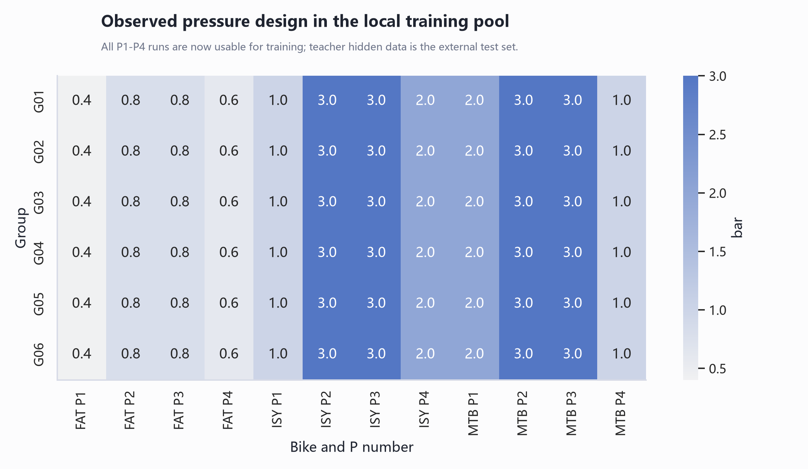
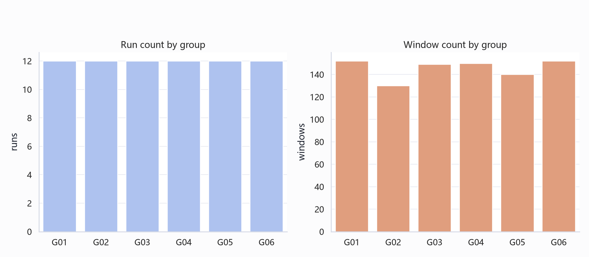
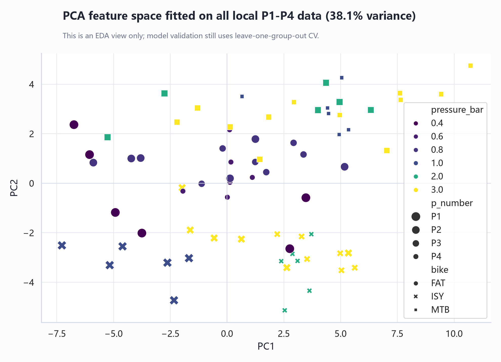
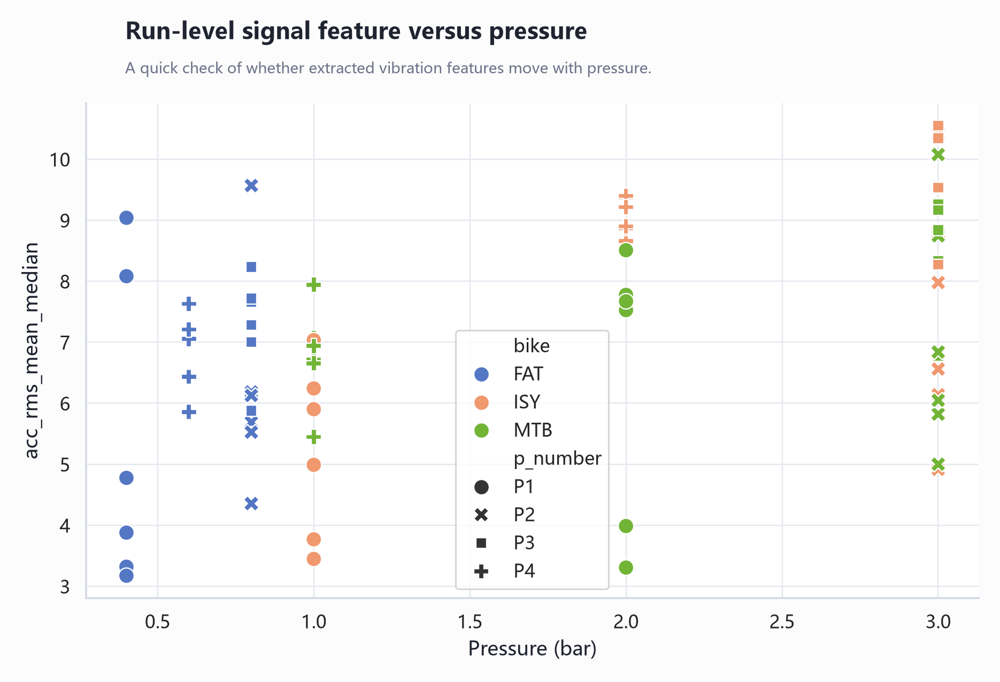
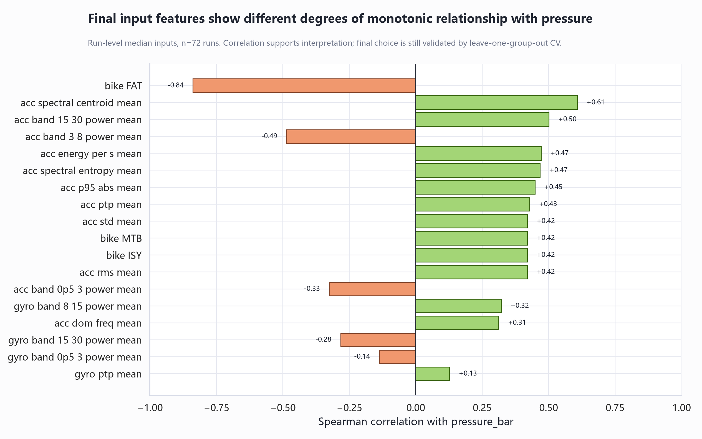
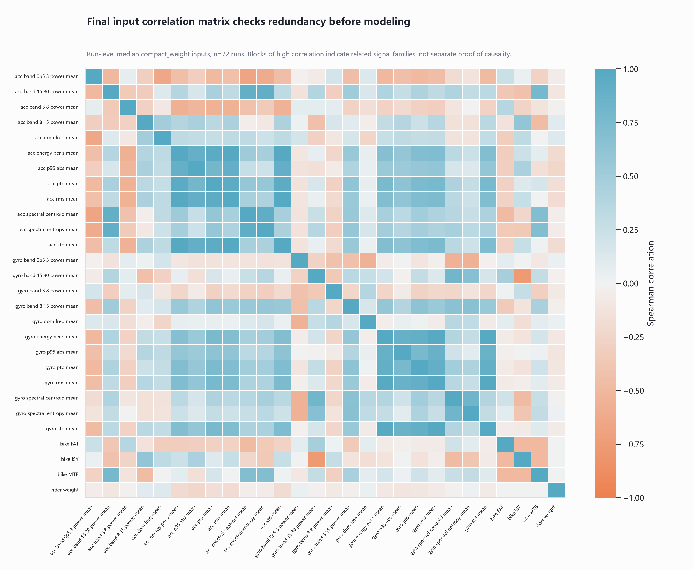

# Step 03: EDA And PCA / EDA 和 PCA

脚本 / Script:

`06_reproducible_pipeline/steps/03_make_eda_figures.py`

核心模块 / Core modules:

- `plotting.py`
- `feature_pipeline.py`

## What EDA Does / EDA 做了什么

1. 检查实验设计中不同 group、bike、P 编号对应的胎压。
   Check the tire-pressure design across group, bike, and P number.
2. 检查每组 run 数和窗口数是否平衡。
   Check whether run counts and window counts are balanced across groups.
3. 用 PCA 把高维特征压到二维，观察不同胎压和单车类型是否有分离趋势。
   Use PCA to project high-dimensional features into two dimensions and inspect separation by pressure and bike type.
4. 画 run-level 特征和胎压之间的关系。
   Plot run-level feature relationships with tire pressure.
5. 计算 run-level 相关性，用来解释哪些输入和胎压关系更明显。
   Compute run-level correlations to explain which inputs are more strongly related to tire pressure.
6. 计算最终输入之间的相关性矩阵，用来检查特征冗余。
   Compute the final-input correlation matrix to check feature redundancy.

## How PCA Is Done / PCA 怎么做

使用的包 / Packages:

- `sklearn.preprocessing.StandardScaler`
- `sklearn.decomposition.PCA`

步骤 / Steps:

1. 从窗口特征构建模型输入矩阵。
   Build the model input matrix from window-level features.
2. 对全部本地 P1-P4 training pool 特征做标准化。
   Standardize all local P1-P4 training-pool features.
3. 拟合 PCA，保留前两个主成分。
   Fit PCA and keep the first two principal components.
4. 每个 run 的窗口 PCA 坐标取中位数，得到 run-level 点。
   Take the median of each run's window-level PCA coordinates to obtain run-level points.

为什么现在 PCA 可以用 P1-P4 全部数据 / Why PCA can use all P1-P4 local data now:

- 因为 P1-P4 都属于训练池。
- Because P1-P4 are all part of the local training pool.
- 这张图只是 EDA，不是最终测试评估。
- This figure is for EDA only, not final test evaluation.
- 真正的泛化估计在 Step 04 中通过 leave-one-group-out CV 完成。
- Generalization is estimated in Step 04 through leave-one-group-out CV.

这里说的是 Step 03 的二维 PCA 可视化。Step 04 的最终 FFNN 模型也使用 PCA，但用途不同：模型先把选中的 28 个 `compact_weight` 输入特征标准化，再用 `PCA(n_components=6)` 降维，最后输入神经网络。

This refers to the two-dimensional PCA visualization in Step 03. The final FFNN in Step 04 also uses PCA, but for a different purpose: the selected 28 `compact_weight` input features are standardized, reduced with `PCA(n_components=6)`, and then passed into the neural network.

## Correlation Analysis / 相关性分析怎么做

相关性分析不使用 873 行窗口级数据直接计算，而是先聚合到 72 行 run-level 数据。这样做是因为同一个 run 的窗口高度相关，不能当成独立样本。

Correlation analysis is not computed directly on the 873 window rows. Instead, features are aggregated to 72 run-level rows first, because windows from the same run are highly correlated and should not be treated as independent samples.

输出了两类证据 / Two evidence tables are produced:

- `training_pool_candidate_feature_target_correlations.csv`：132 个候选输入与 `pressure_bar` 的 Pearson / Spearman 相关性。 / Pearson and Spearman correlations between the 132 candidate inputs and `pressure_bar`.
- `training_pool_final_input_correlation_matrix.csv`：28 个最终输入之间的 Spearman 相关性矩阵。 / Spearman correlation matrix among the 28 final inputs.

这些结果用于解释特征选择，但不直接替代 Step 04 的 leave-one-group-out CV。

These results support feature-selection explanation, but they do not replace the leave-one-group-out CV in Step 04.

## EDA Findings / EDA 结论

1. 当前训练池包含 72 个 labeled runs 和 873 个 window rows。EDA 结论主要按 run-level median 计算，而不是直接把 873 个窗口都当成独立样本，因为同一个 run 内的窗口来自同一次骑行，统计上高度相关。
   The current training pool contains 72 labeled runs and 873 window rows. EDA findings are mainly computed at run-level median rather than treating all 873 windows as independent observations, because windows from the same run come from the same ride and are statistically related.

2. 胎压和单车类型存在强耦合，不能只看传感器信号。比如 `bike_FAT` 与 `pressure_bar` 的 Spearman 相关性为 -0.839，这不是说 FAT 这个变量“导致”低胎压，而是说明不同 bike 的胎压范围和结构差异会影响数据分布。因此最终输入保留 `bike_FAT`、`bike_ISY`、`bike_MTB` 作为 context features。
   Tire pressure and bike type are strongly coupled, so sensor signals should not be interpreted alone. For example, `bike_FAT` has Spearman correlation -0.839 with `pressure_bar`; this does not mean FAT causes low pressure, but shows that bike-specific pressure ranges and structures affect the data distribution. Therefore `bike_FAT`, `bike_ISY`, and `bike_MTB` are kept as context features.

3. 加速度特征比陀螺仪特征更直接地反映胎压变化。最终输入中，`acc_spectral_centroid_mean` 与胎压的 Spearman 相关性为 0.607，`acc_band_15_30_power_mean` 为 0.501，`acc_band_3_8_power_mean` 为 -0.486，`acc_energy_per_s_mean` 为 0.471。这说明胎压变化确实会改变振动能量大小和频率分布。
   Acceleration features show a more direct relationship with tire pressure than gyroscope features. Among final inputs, `acc_spectral_centroid_mean` has Spearman correlation 0.607 with pressure, `acc_band_15_30_power_mean` 0.501, `acc_band_3_8_power_mean` -0.486, and `acc_energy_per_s_mean` 0.471. This supports the physical idea that tire pressure changes vibration intensity and frequency distribution.

4. 陀螺仪特征的全局相关性整体较弱，但仍保留一部分。原因是转动信号可能在不同 bike 或不同骑行者下提供辅助信息；不过从当前训练池看，它不能单独作为最强证据。
   Gyroscope features have weaker global target correlations overall, but selected gyro features are still retained because rotational signals may provide auxiliary information under different bikes or riders. In the current training pool, however, they are not the strongest standalone evidence.

5. 最终输入之间存在明显冗余。相关矩阵中大块蓝色区域表示很多特征一起升高或降低，例如 `acc_rms_mean` 与 `acc_std_mean` 的 Spearman 相关性为 0.998，`gyro_rms_mean` 与 `gyro_std_mean` 为 0.992，`acc_energy_per_s_mean` 与 `acc_rms_mean` 为 0.988。共有 21 对最终输入的绝对 Spearman 相关性不低于 0.85。
   The final inputs contain clear redundancy. Large blue blocks in the correlation matrix mean many features increase or decrease together. For example, `acc_rms_mean` and `acc_std_mean` have Spearman correlation 0.998, `gyro_rms_mean` and `gyro_std_mean` 0.992, and `acc_energy_per_s_mean` and `acc_rms_mean` 0.988. There are 21 final-input pairs with absolute Spearman correlation at least 0.85.

6. 这张相关矩阵支持后续建模策略：不能简单地把所有强相关特征都当作独立证据，也不适合直接上很复杂的神经网络。更合理的做法是使用标准化、PCA 降维、较小 FFNN、正则化和 leave-one-group-out CV。
   This correlation matrix supports the later modeling strategy: highly correlated features should not be treated as independent evidence, and a large neural network would be risky. A more defensible approach is standardization, PCA reduction, a small FFNN, regularization, and leave-one-group-out CV.

7. `rider_weight_kg` 与胎压的直接 Spearman 相关性只有 0.011，所以它不是一个单独很强的胎压预测变量。但它有物理意义，因为骑行者重量会改变轮胎载荷、形变和振动响应，因此作为 context feature 保留。
   `rider_weight_kg` has only 0.011 direct Spearman correlation with pressure, so it is not a strong standalone pressure predictor. It is still physically meaningful because rider weight changes tire load, deformation, and vibration response, so it is retained as a context feature.

8. EDA 的总体结论是：数据里确实存在与胎压相关的振动信号，但这些信号同时受到 bike 类型、骑行者重量、特征冗余和 group 差异影响。因此 EDA 只能支持建模假设，最终模型好不好必须看 Step 04 的 leave-one-group-out CV。
   The overall EDA conclusion is that the data does contain tire-pressure-related vibration information, but the signal is mixed with bike type, rider weight, feature redundancy, and group differences. Therefore EDA supports the modeling hypothesis, but final model quality must be judged by the leave-one-group-out CV in Step 04.

## How To Read The Correlation Matrix / 怎么读相关矩阵

- 对角线永远是 1，因为每个特征和自己完全相关。
  The diagonal is always 1 because every feature is perfectly correlated with itself.
- 蓝色表示正相关：一个特征变大时，另一个也倾向于变大。
  Blue means positive correlation: when one feature increases, the other tends to increase.
- 橙色表示负相关：一个特征变大时，另一个倾向于变小。
  Orange means negative correlation: when one feature increases, the other tends to decrease.
- 成块的蓝色或橙色说明这些变量属于相近的信息家族，例如 amplitude/energy 类特征、frequency-band power 类特征或 bike one-hot context。
  Blocks of blue or orange indicate related information families, such as amplitude/energy features, frequency-band power features, or bike one-hot context.
- 这张图只能说明统计相关和冗余，不能单独证明因果关系，也不能直接证明模型泛化能力。
  This figure shows statistical association and redundancy only; it does not prove causality or model generalization by itself.

## Figures / 图表

