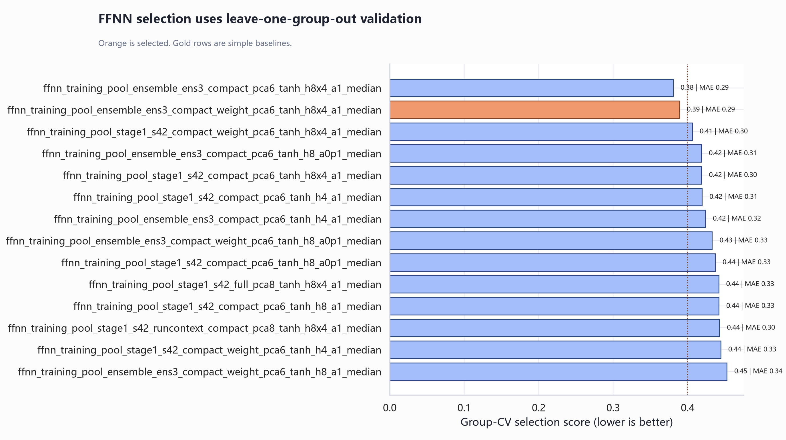
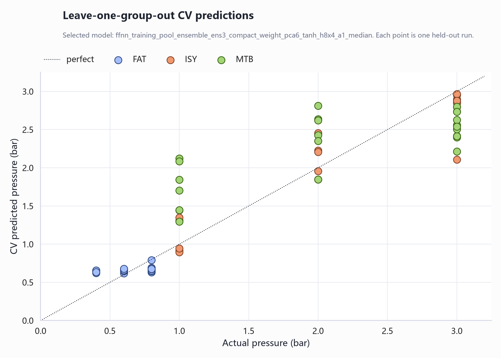
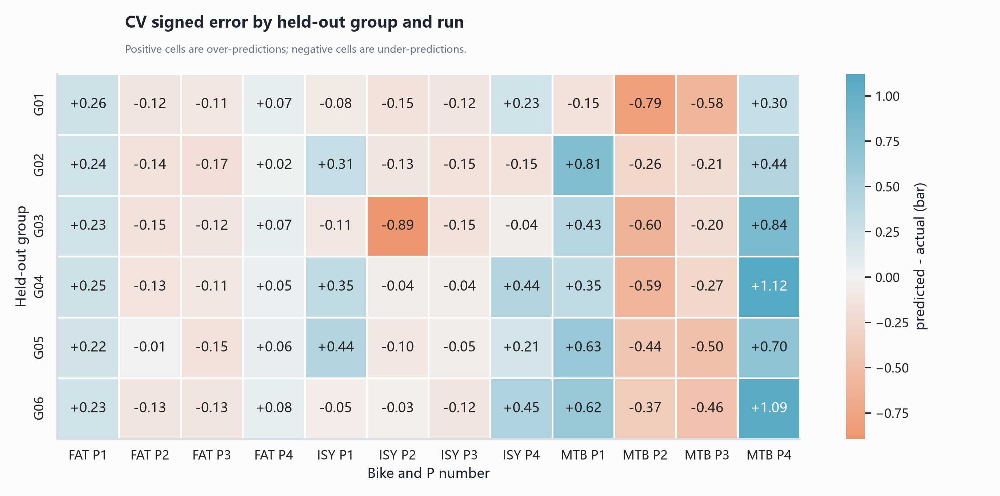
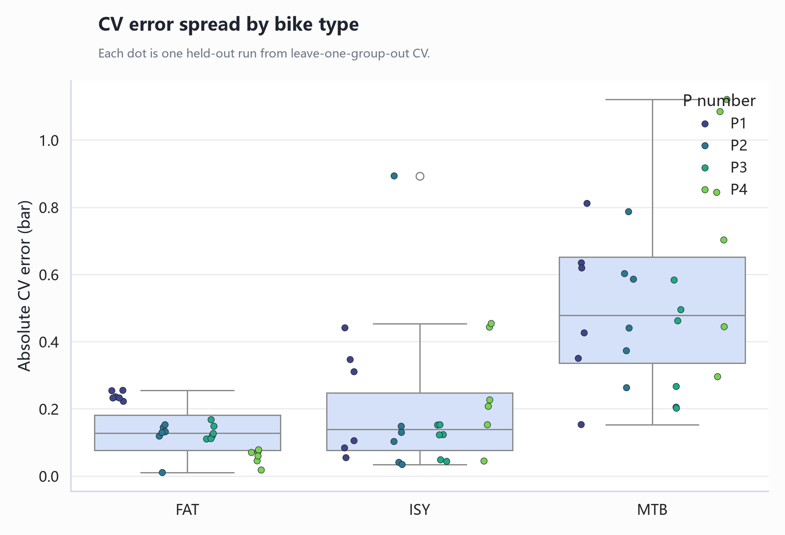
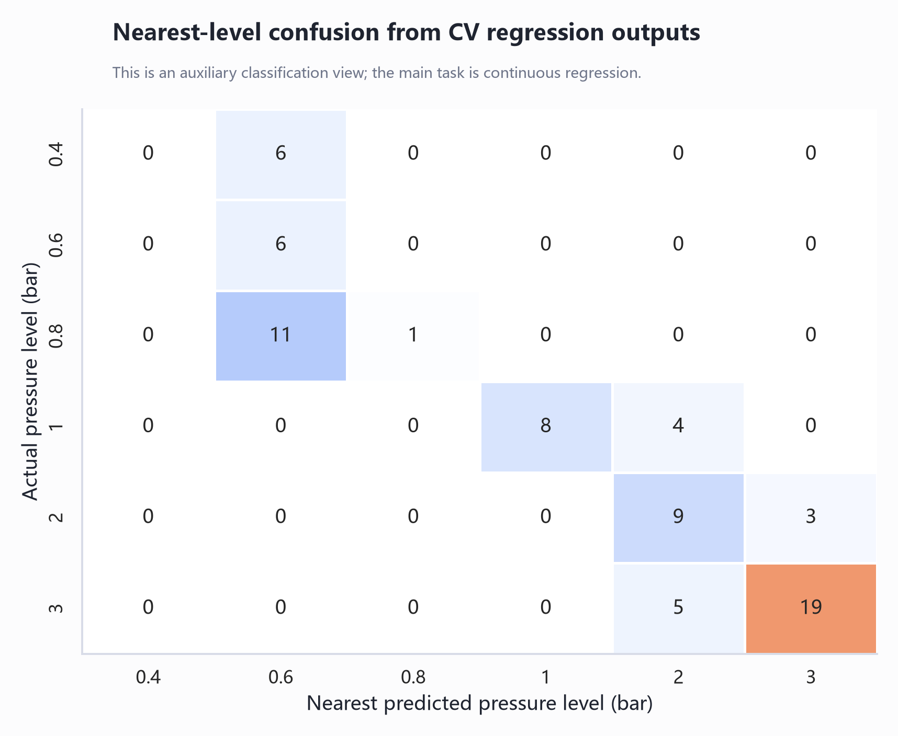

# Step 04: FFNN Model Selection / FFNN 模型选择

脚本 / Script:

`06_reproducible_pipeline/steps/04_group_cv_model_selection.py`

核心模块 / Core modules:

- `modeling.py`
- `plotting.py`

## Modeling Task / 模型任务

这是回归任务，预测连续胎压：

This is a regression task that predicts continuous tire pressure:

`pressure_bar`

它不是直接分类 P1/P2/P3/P4。

It is not a direct classification of P1/P2/P3/P4.

## Train/Validation Split / 训练集和验证集怎么划分

使用 leave-one-group-out cross-validation。

We use leave-one-group-out cross-validation.

| Fold | Training | Validation |
|---|---|---|
| 1 | G02-G06 | G01 |
| 2 | G01,G03-G06 | G02 |
| 3 | G01-G02,G04-G06 | G03 |
| 4 | G01-G03,G05-G06 | G04 |
| 5 | G01-G04,G06 | G05 |
| 6 | G01-G05 | G06 |

每个 validation fold 有 12 个 run。

Each validation fold contains 12 runs.

## How CV, Ensemble, And Optimizer Iterations Fit Together / CV、ensemble 和优化迭代怎么组合

这里有两个不同层级的“重复”：

There are two different levels of repetition:

```text
外层 / outer loop: leave-one-group-out CV repeats 6 folds
内层 / inner loop: each model training uses many lbfgs optimizer iterations
```

CV 的 6 次不是让同一个模型训练 6 遍，而是为了评估模型结构。每一折都会重新训练一个模型，然后只用它预测被留出的 group。

The 6 CV folds do not train one single model six times to make it better. They are used to evaluate the model structure. In each fold, a new model is trained from scratch and then used only to predict the held-out group.

例如：

For example:

```text
Fold 1: train G02-G06, validate G01
Fold 2: train G01,G03-G06, validate G02
...
Fold 6: train G01-G05, validate G06
```

在每一个 fold 里面，`MLPRegressor(solver='lbfgs')` 会从初始权重开始，用训练 fold 的全部数据做优化。这里的 `lbfgs iteration` 是优化器调整网络权重的步骤，不是传统 mini-batch epoch。

Inside each fold, `MLPRegressor(solver='lbfgs')` starts from initial weights and optimizes the network using all training data in that fold. An `lbfgs iteration` is an optimizer step that updates/searches the network weights. It is not the same as a traditional mini-batch epoch.

因为选中的模型是 `ensemble_ens3`，每个 fold 还会训练 3 个相同结构但不同随机种子的模型：

Because the selected model is `ensemble_ens3`, each fold trains three models with the same architecture but different random seeds:

```text
seed 11
seed 42
seed 91
```

所以在模型选择阶段，选中结构的 CV 评估可以理解为：

Therefore, during model selection, the selected structure's CV evaluation can be understood as:

```text
6 CV folds × 3 ensemble seeds × many lbfgs optimizer iterations per training
```

每个 fold 里，三个 seed 模型分别预测 validation group，然后把三个预测取平均。之后，每个 run 的多个窗口预测再用 median 聚合成 run-level 胎压预测。

Within each fold, the three seed models predict the validation group and their predictions are averaged. Then, the multiple window-level predictions within each run are aggregated with the median to produce one run-level pressure prediction.

这个逻辑可以总结为：

The logic can be summarized as:

```text
CV fold = how we test the model structure on unseen groups
lbfgs iterations = how one model is optimized inside one training run
ensemble seeds = how we reduce randomness from initialization
median aggregation = how window predictions become one run prediction
```

## Input Features / 输入特征

基础输入 / Base inputs:

- 传感器信号特征。 / Sensor signal features.
- bike type one-hot。 / Bike-type one-hot features.
- rider weight。 / Rider weight.

Step 02 生成的完整候选输入池有 132 个特征：

The full candidate input pool generated in Step 02 contains 132 features:

- 128 个 `acc` / `gyro` 信号特征。 / 128 `acc` / `gyro` signal features.
- 3 个 bike type one-hot：`bike_FAT`, `bike_ISY`, `bike_MTB`。 / Three bike-type one-hot features: `bike_FAT`, `bike_ISY`, `bike_MTB`.
- 1 个 rider weight：`rider_weight_kg`。 / One rider-weight feature: `rider_weight_kg`.

这 132 个特征是完整候选池，不代表最终模型一定全部使用。模型选择阶段会比较不同输入空间。

These 132 features are the full candidate pool. The final model does not necessarily use all of them; model selection compares several feature spaces.

候选输入空间 / Candidate feature spaces:

- `compact`
- `full`
- `compact_interact`
- `runmed_compact`
- `runcontext_compact`
- `compact_weight`
- `runcontext_compact_weight`

rider weight 参与候选比较，并且当前规则要求最终模型必须使用它。

Rider weight is included in the candidate comparison, and the current project rule requires the final model to use it.

## How The 28 `compact_weight` Features Are Selected / 28 个 `compact_weight` 特征怎么选出来

最终选中模型使用的是 `compact_weight_pca6`。这里的 `compact_weight` 不是 PCA 自动选出来的，也不是根据最终测试集挑出来的，而是在建模前人工定义的一组更稳健、更容易解释的特征子集，并额外加入 `rider_weight_kg`。

The selected model uses `compact_weight_pca6`. Here, `compact_weight` is not automatically selected by PCA and is not chosen using a final test set. It is a manually defined, robust, interpretable feature subset created before modeling, with `rider_weight_kg` added.

具体筛选规则在 `modeling.py` 的 `compact_signal_columns()` 中。它只保留：

The exact rule is implemented in `compact_signal_columns()` in `modeling.py`. It keeps:

1. 以 `acc_` 或 `gyro_` 开头的信号特征。 / Signal features starting with `acc_` or `gyro_`.
2. 双传感器聚合方式只保留 `_mean`。 / Only the `_mean` two-sensor aggregation.
3. 只保留 12 类物理含义比较直接的特征家族。 / Only 12 physically interpretable feature families.

| 特征家族 / Feature family | 含义 / Meaning |
|---|---|
| `rms` | 均方根振动强度 / RMS vibration intensity |
| `std` | 波动标准差 / standard deviation of fluctuation |
| `energy_per_s` | 单位时间能量 / energy per second |
| `p95_abs` | 绝对振动幅值的 95 分位数 / 95th percentile of absolute vibration amplitude |
| `ptp` | peak-to-peak 范围 / peak-to-peak range |
| `dom_freq` | 主导频率 / dominant frequency |
| `spectral_centroid` | 频谱重心 / spectral centroid |
| `spectral_entropy` | 频谱分散程度 / spectral dispersion |
| `band_0p5_3_power` | 0.5-3 Hz 频带功率比例 / 0.5-3 Hz band-power ratio |
| `band_3_8_power` | 3-8 Hz 频带功率比例 / 3-8 Hz band-power ratio |
| `band_8_15_power` | 8-15 Hz 频带功率比例 / 8-15 Hz band-power ratio |
| `band_15_30_power` | 15-30 Hz 频带功率比例 / 15-30 Hz band-power ratio |

这些特征同时对 `acc` 和 `gyro` 各保留一套，所以 `12 类特征 * 2 类信号 = 24 个信号特征`。再加上 3 个 bike type one-hot 和 1 个 rider weight，得到 `24 + 3 + 1 = 28` 个 `compact_weight` 输入特征。

The same 12 feature families are kept for both `acc` and `gyro`, giving `12 feature families * 2 signal types = 24 signal features`. Adding three bike-type one-hot columns and one rider-weight column gives `24 + 3 + 1 = 28` `compact_weight` input features.

当前最终模型使用的 28 个 PCA 前输入列 / The 28 pre-PCA input columns used by the final model:

```text
acc_band_0p5_3_power_mean
acc_band_15_30_power_mean
acc_band_3_8_power_mean
acc_band_8_15_power_mean
acc_dom_freq_mean
acc_energy_per_s_mean
acc_p95_abs_mean
acc_ptp_mean
acc_rms_mean
acc_spectral_centroid_mean
acc_spectral_entropy_mean
acc_std_mean
gyro_band_0p5_3_power_mean
gyro_band_15_30_power_mean
gyro_band_3_8_power_mean
gyro_band_8_15_power_mean
gyro_dom_freq_mean
gyro_energy_per_s_mean
gyro_p95_abs_mean
gyro_ptp_mean
gyro_rms_mean
gyro_spectral_centroid_mean
gyro_spectral_entropy_mean
gyro_std_mean
bike_FAT
bike_ISY
bike_MTB
rider_weight_kg
```

## Why These 28 Features Are Used / 为什么这样选 28 个

这样做主要是为了控制小样本过拟合风险。虽然窗口级样本有 873 行，但这些窗口来自 72 个 run，同一个 run 内的窗口并不是完全独立样本。因此模型的有效样本量更接近 run 数量，而不是简单等于 873。

The main purpose is to reduce overfitting risk in a small-sample setting. Although there are 873 window-level rows, they come from 72 runs, and windows within the same run are not independent. The effective sample size is therefore closer to the number of runs than to 873.

选择 compact 特征的目的 / Reasons for compact features:

1. 保留和胎压物理关系最直接的振动指标，例如 RMS、标准差、能量、峰峰值和频带功率。 / Keep physically meaningful vibration indicators such as RMS, standard deviation, energy, peak-to-peak range, and band power.
2. 保留频域信息，因为胎压变化可能改变振动频率分布和阻尼表现。 / Keep frequency-domain information because tire pressure may change frequency distribution and damping behavior.
3. 只用双传感器平均值 `_mean`，降低单个传感器局部冲击、安装差异或噪声对模型的影响。 / Use only the two-sensor `_mean` aggregation to reduce local impact, mounting, or noise effects from a single sensor.
4. 去掉 `_max`、`_min`、`_absdiff`、`skew`、`kurtosis` 等更容易受异常窗口影响的特征。 / Remove features such as `_max`, `_min`, `_absdiff`, `skew`, and `kurtosis`, which are more sensitive to abnormal windows.
5. 保留 bike one-hot，因为 FAT、ISY、MTB 的结构和胎压范围不同。 / Keep bike one-hot features because FAT, ISY, and MTB differ in structure and pressure range.
6. 加入 rider weight，因为骑手体重会改变轮胎压缩、冲击响应和振动强度。 / Add rider weight because rider load changes tire compression, impact response, and vibration intensity.

当前选择逻辑可以总结为：

The current selection chain can be summarized as:

`完整 132 个候选特征 -> 人工定义 compact_weight 28 个稳健特征 -> StandardScaler -> PCA 到 6 维 -> FFNN ensemble`

`Full 132 candidate features -> manually defined 28 robust compact_weight features -> StandardScaler -> PCA to 6 dimensions -> FFNN ensemble`

更完整的解释见 [[11_Feature_Selection_Rationale]]。 / See [[11_Feature_Selection_Rationale]] for the full evidence chain.

## Model Structure / 模型结构

选中模型 / Selected model:

`ffnn_training_pool_ensemble_ens3_compact_weight_pca6_tanh_h8x4_a1_median`

| 部分 / Part | 含义 / Meaning |
|---|---|
| `ensemble_ens3` | 3 个随机种子模型取平均 / average of three random-seed models |
| `compact_weight_pca6` | compact + rider weight 特征空间，PCA 压到 6 维 / compact + rider-weight feature space reduced to 6 PCA dimensions |
| `tanh` | 隐藏层激活函数 / hidden-layer activation |
| `h8x4` | 两个隐藏层，分别 8 和 4 个神经元 / two hidden layers with 8 and 4 neurons |
| `a1` | L2 正则 alpha = 1.0 / L2 regularization alpha = 1.0 |
| `median` | 窗口预测聚合为 run 预测时取中位数 / median aggregation from window predictions to run prediction |

sklearn pipeline:

1. `StandardScaler`
2. `PCA(n_components=6)`
3. `MLPRegressor(hidden_layer_sizes=(8, 4), activation='tanh')`

## Model-Selection Score / 模型选择分数

`CV score = MAE + 0.10*RMSE + 0.10*|bias| + 0.05*max_abs_error + 0.03*group_MAE_std`

然后在 CV score 距离最优 FFNN 5% 以内、且包含 `rider_weight_kg` 的模型中，选择更简单的网络。

Among FFNNs within 5% of the best CV score and containing `rider_weight_kg`, the simpler network is selected.

## Current Result / 当前结果

| 指标 / Metric | 值 / Value |
|---|---:|
| CV MAE | 0.290 bar |
| CV RMSE | 0.388 bar |
| CV bias | 0.031 bar |
| nearest-level accuracy | 0.597 |
| macro-F1 | 0.466 |

按 bike 的 MAE / MAE by bike:

| Bike | MAE |
|---|---:|
| FAT | 0.136 |
| ISY | 0.203 |
| MTB | 0.532 |

按 held-out group 的 MAE / MAE by held-out group:

| Held-out group | MAE |
|---|---:|
| G01 | 0.247 |
| G02 | 0.253 |
| G03 | 0.321 |
| G04 | 0.312 |
| G05 | 0.293 |
| G06 | 0.315 |

## Figures / 图表










